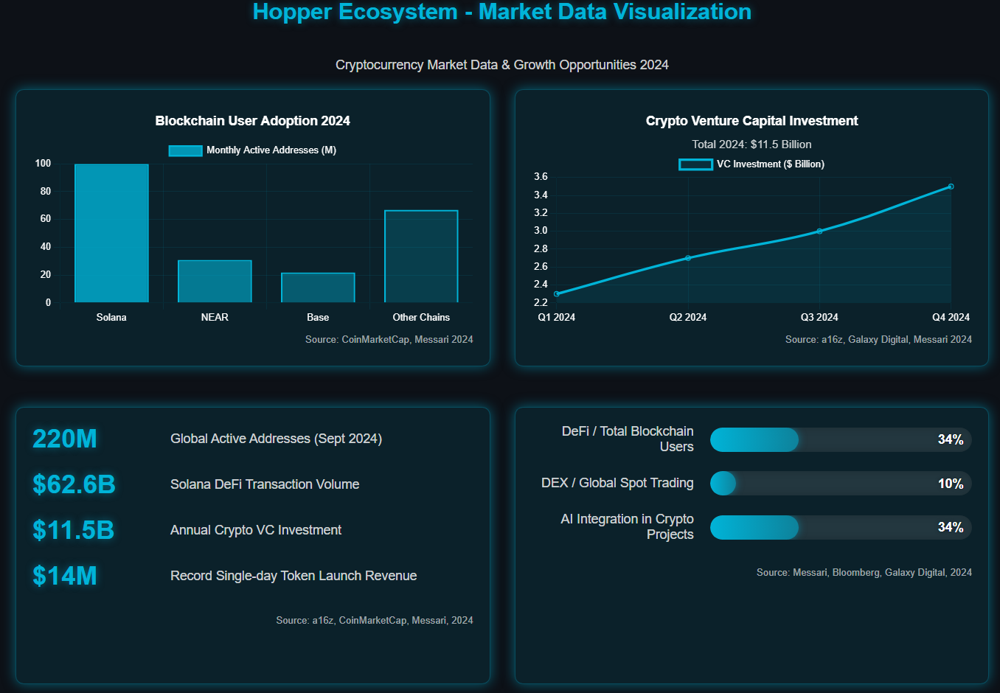
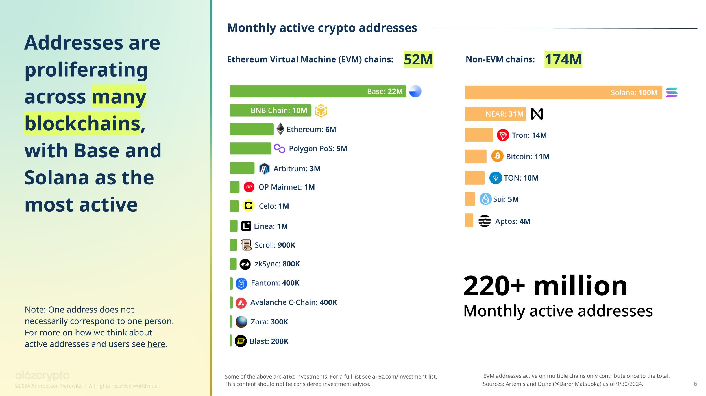
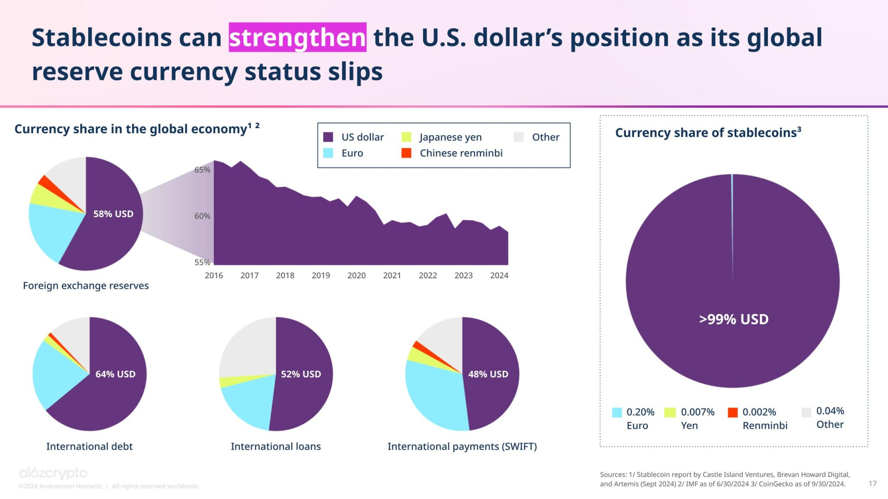

# Executive Summary

### **Executive Summary**

#### **Industry Development Overview**

The cryptocurrency industry reached a critical turning point in 2024, with increasing scale adoption and institutional recognition signaling a new stage of development. According to data from a16z's "State of Crypto Report 2024" \[1], CoinMarketCap's "Week in Solana: 2024 Recap" \[2], and Galaxy Digital's latest "Crypto & Blockchain Venture Capital – Q4 2024" \[3], multiple indicators suggest this sector is experiencing unprecedented growth opportunities.

<figure><figcaption></figcaption></figure>

**Explosive User Adoption Growth**

In September 2024, global active addresses reached 220 million \[2], representing **over 200% growth compared to the end of 2023**. Among blockchains, **Solana** demonstrated particularly outstanding performance, reaching 100 million monthly active addresses, far ahead of other public chains. Following closely were **NEAR** (31 million) and Coinbase's **Base** (22 million).

These data confirm the breakthrough growth of the Solana ecosystem, with DeFi transaction volume reaching **$62.6 billion**, nearly matching Ethereum's $67.4 billion. Mobile wallet users reached a historic high of 29 million in June 2024, strongly demonstrating the increasing global adoption of cryptocurrencies.

According to Messari's "State of DeFi Q4 2024" \[4], daily active DeFi users now account for **34%** of total blockchain daily active users, a growth trend clearly indicating that DeFi is becoming a mainstream application of blockchain technology.

<figure><figcaption></figcaption></figure>

**Continued Venture Capital Investment**

In the fourth quarter of 2024, cryptocurrency startups received **$3.5 billion** in investment (a quarter-over-quarter increase of **46%**) \[1], with annual investment reaching an impressive **$11.5 billion**. According to Messari's "State of Crypto Fundraising: Q2 2024" \[5], transaction volume that quarter increased by **22.5%** compared to the previous quarter, with particularly active financing in network, financial, and infrastructure sectors.

<figure><figcaption></figcaption></figure>

Analyzing the latest investment data, we can observe the following significant characteristics:

**Investment Stage Distribution**

* **Early-stage projects** account for 60% of investment amounts
* **Late-stage projects** account for 40%, a significant increase from 15% in the previous quarter
* **Seed round** project numbers maintain healthy levels, strongly demonstrating the increasingly active entrepreneurial ecosystem

<figure><figcaption></figcaption></figure>

**Sector Distribution**

* **Stablecoin projects** received the most funding support, reflecting high market confidence in infrastructure
* **Infrastructure** and **Web3** projects followed closely
* **Web3**, **DeFi**, and **Infrastructure** projects accounted for the highest number of investment cases

<figure><figcaption></figcaption></figure>

**Geographic Distribution**

* **US** companies received 46% of investment amounts, maintaining global leadership
* **Hong Kong** companies increased to 17%, a significant rise from previous periods
* **Singapore** and **UK** companies also showed very active, stable development

<figure><figcaption></figcaption></figure>

**Rapid Growth in the MEME Token Market**

The MEME token market demonstrated unprecedented prosperity in 2024, with this combined track entering the **4th position among the top 20 cryptocurrency hotspots of 2024** \[3]. The latest market data highlights the remarkable rise of this sector:

* The leading token launch platform **Pump.fun** achieved monthly revenue exceeding **$100 million**, setting a new industry record
* On New Year's Day 2025, Pump.fun's single-day revenue reached an astonishing **$14 million**
* The platform has successfully launched over **4 million** different token projects, clearly demonstrating the enormous market demand for efficient, secure token launch platforms

This market trend perfectly aligns with **Hopper's** launch platform strategy, providing a vast market space for our innovative token launch mechanism.

**Accelerated Institutional Investment**

Institutional investor participation saw a breakthrough increase by the end of 2024 \[1], marking the maturity and mainstreaming of the cryptocurrency market:

**Rapid Development of ETFs and Listed Products**

* Institutions such as **VanEck**, **21Shares**, **Bitwise**, and **Canary Capital** have successively applied for Solana ETFs
* Bitcoin and Ethereum ETPs collectively hold over **$65 billion** in on-chain assets, forming a powerful institutional capital pool

**Expanded Research Coverage**

* The prominent investment institution **Grayscale** has included Jupiter (JUP) and Jito (JTO) in its **2025 Q1 core investment portfolio**
* Mainstream investment banks have begun systematic in-depth research on the Solana ecosystem, such as Bloomberg's "Digital Assets 101" \[6] report, which provides detailed analysis of the ecosystem's profound development potential

**Rapid Expansion of the Stablecoin Market**

* **December alone** saw an increase of **$1 billion** in total locked value, with underlying demand continuing to grow
* The stablecoin TVL on **Solana** has approached **$5 billion**, forming an important payment and settlement infrastructure
* Stablecoin issuers have become the **20th largest holder of U.S. Treasury bonds**, creating a powerful connection with the traditional financial system

<figure><figcaption></figcaption></figure>

**Rapid Expansion of Innovative Application Scenarios**

With significant improvements in infrastructure and continued reduction in transaction costs, the cryptocurrency field is witnessing a series of revolutionary new application scenarios \[3]:

**Accelerated Maturity of the DeFi Ecosystem**

* DeFi wallet addresses have reached **34%** of total daily active addresses, an increase of **12 percentage points** compared to 2023
* DEX trading volume accounts for **10%** of global spot trading, with Bloomberg research indicating this proportion could reach **15%** under specific market conditions \[6]
* Total value locked has reached **$169 billion**, strongly demonstrating the market's deep trust and adoption of DeFi protocols

<figure><figcaption></figcaption></figure>

**Explosive Growth in Social Finance**

* **SocialFi** projects now account for **10.3%**, according to Messari's "State of DePIN 2024" \[7] research, social finance is rapidly becoming a distinctive growth hotspot for blockchain applications
* Social networks have entered the **top five most active developer domains**, continuously attracting top talent and capital investment
* User engagement and retention have significantly improved, with the average user session duration on new-generation social platforms increasing by **65%**

**Accelerated Integration of AI and Blockchain**

* Currently, **34%** of crypto projects deeply integrate AI technology, double the proportion compared to the same period last year
* AI-related token sectors show extremely active performance, with leading projects achieving weekly gains of up to **193%**
* Infrastructure-class projects have become the most widespread field for AI technology applications, accounting for **47%**, demonstrating the natural synergy between the two

<figure><figcaption></figcaption></figure>

These market trends highly align with Hopper's core product strategy, positioning our lightning-fast transaction speeds, AI-driven intelligent analytics, and comprehensive DeFi ecosystem precisely in the market's most promising frontier areas.

### **Project Vision and Mission**

#### **Redefining the Decentralized Finance Experience**

Hopper is committed to becoming the **core infrastructure for next-generation multi-chain decentralized finance**. Through our breakthrough hybrid market-making mechanism (**AMM+CLMM**), intuitive user interface, and leading cross-chain technology, we have thoroughly redefined how users interact with crypto assets.

Our platform not only provides **lightning-fast transaction speeds** but also builds a comprehensive DeFi ecosystem, including:

* **High-efficiency DEX platform**: Achieving ultra-fast transaction processing and optimal liquidity configuration
* **Innovative token launch platform**: Providing secure, convenient issuance channels for new projects
* **Full-featured MPC wallet**: Ensuring user asset security while enhancing user experience
* **Efficient cross-chain bridging**: Seamlessly connecting multiple blockchain ecosystems

#### **Solving Key Industry Pain Points**

In the current market landscape, traditional trading platforms face multiple challenges:

* **Fragmented liquidity**: Leading to inefficient trading and increased slippage losses
* **Complex user experience**: Limiting ordinary users' participation and adoption
* **Difficult cross-chain interactions**: Hindering seamless collaboration between different ecosystems
* **Unresolved security risks**: Continuously threatening user assets and trust

Hopper emerged in response to these challenges, aiming to thoroughly solve these industry pain points through cutting-edge technological innovation.

#### **Our Mission**

Our core mission is to create a barrier-free multi-chain crypto financial world where:

* **For users**: Providing intuitive, secure, and efficient participation methods regardless of technical background or experience level
* **For innovative projects**: Building comprehensive infrastructure support, providing assistance throughout the entire process from token issuance to growth
* **For the entire industry**: Promoting barrier-free interaction and sustainable development of multi-chain ecosystems

By achieving these goals, Hopper is committed to becoming a core force driving blockchain finance toward truly large-scale adoption.

#### **Main Product Feature Highlights**

**Intelligent Trading Engine**

* Innovative Hybrid Market-Making Mechanism: Combining **AMM and CLMM advantages**, continuously optimizing liquidity configuration through smart algorithms, ensuring **optimal price execution**
* Intelligent Routing System: Multi-dimensional analysis of trading paths, automatically selecting the **lowest slippage** solution, achieving optimal trade execution
* High-Performance Trading System: Optimized on-chain trading mechanisms achieving **millisecond-level response**, supporting advanced trading strategies such as **limit orders**
* Market Insight System: Providing **price predictions** and **arbitrage opportunities** based on real-time market data, helping users seize market opportunities
* Smart Contract Ecosystem: Complete smart contract system ensuring **automated execution** of transactions, enhancing transaction transparency and traceability

**Hopper Launch Platform**

* Optimized Issuance Process: Simplified and standardized token launch process, **requiring only sufficient liquidity to list** on the DEX
* Intelligent Security Mechanism: Built-in **anti-bot** and **anti-dumping** systems, protecting early investors' interests
* Flexible Launch Solutions: Project teams can **customize** key parameters such as initial liquidity and unlock mechanisms
* AI Risk Control System: **Intelligent assessment** of project risks, providing professional investment references for users
* Complete Incubation Support: **Full-process incubation** services from project design to operation, supporting projects' healthy development

**Cross-chain Asset Management**

* Efficient Cross-chain Bridge: Supporting **rapid asset transfers** between mainstream public chains, innovative **liquidity aggregation** solutions ensuring stability
* One-click Cross-chain Transactions: Simplified user interface, making cross-chain transactions as **simple and intuitive as in-chain transactions**
* Real-time Status Monitoring: **Complete tracking** of cross-chain transaction status, providing a transparent asset transfer experience
* Multi-chain Asset Integration: Innovative cross-chain infrastructure allowing users to **easily manage** and trade multi-chain assets

**Hopper MPC Wallet**

* Distributed Security Architecture: Innovative solution based on **MPC technology**, enhancing asset security through **private key sharding** storage
* Intelligent Recovery Mechanism: Innovative **social recovery** function, providing convenient recovery solutions while ensuring security
* Smart Contract Integration: Supporting **contract wallet** features, enhancing transaction flexibility
* One-stop DApp Center: Built-in **DApp browser**, providing seamless application experience
* Privacy Protection System: Employing advanced encryption technology, **comprehensively protecting** user data and transaction privacy

**Community Ecosystem**

* One-stop Service Platform: Seamless integration of core functions such as **wallet management**, **transaction execution**, and **community interaction**
* Community Governance Framework: Innovative **community incentive** mechanisms, cultivating an active and valuable user ecosystem
* Decentralized Identity: **Self-sovereign** identity management solution, achieving balance between privacy protection and personalized services
* Social Finance Innovation: Deep integration of **social interaction** and **financial functions**, creating unique value incentive models

#### **Team Core Competitive Strengths**

**Core Team Background**

* System Architecture Experts
  * Former Google Senior Engineer, responsible for Google Pay payment system architecture
  * Led the construction of payment clearing systems with daily transaction volumes exceeding $10 billion
  * Proficient in high-performance programming languages such as Rust and Go
* Blockchain Technology Experts
  * Former Aave V3 core developer, responsible for smart contract architecture design
  * Participated in the development of 5+ DeFi projects with TVL exceeding $1 billion
  * Core contributor to 50+ blockchain open-source projects on Github

**Technological Innovation Achievements**

* High-Performance Trading Engine
  * Automatically adjusts liquidity pools through algorithms, reducing slippage and improving trading efficiency
  * Dynamic pricing, adjusting token prices in real-time based on supply and demand, preventing market manipulation
  * System availability of 99.99%
* Security Technology Architecture
  * Independently developed 5 MPC wallet core patents
  * Completed 200+ smart contract security audits
  * Zero security incident record

**Trading System Innovations**

* Hybrid Market-Making Mechanism
  * Innovative market-making algorithm combining PMM and AMM advantages
  * Improves capital utilization by 35% compared to traditional AMM
  * Reduces slippage losses by 50%
* AI Trading Optimization
  * Intelligent routing system, saving 40% in transaction costs
  * Real-time price prediction with 85% accuracy
  * Personalized trading strategy recommendations

**Industry Resources**

Institutional Partners

* Top Market Makers
  * Wintermute: Daily market-making trading volume of $50 million
  * GSR: Providing $10 million in market-making capital support
  * DWF Labs: Strategic investment and market-making support
* Infrastructure Collaboration
  * Chainlink: Oracle data support
  * Axelar: Cross-chain infrastructure integration
  * NodeReal: Dedicated RPC node support

Investment Institution Support

* Strategic Investors
  * Binance Labs: Strategic investment and ecosystem support
  * Jump Trading: Market-making and technical support

**Market Insights**

Industry Experience

* DeFi Project Experience
  * Participated in Uniswap V3 early liquidity strategy design
  * Provided technical consulting for 3 projects with $10+ billion market cap
  * Experienced the complete 2021-2024 bull-bear cycle

User Need Understanding

* Product Innovation Direction
  * Pioneered one-click cross-chain aggregated trading
  * Innovative Gas payment mechanism
  * Mobile-first product design philosophy

**Core Competitive Advantages**

1. Technology Barriers
   * Self-developed MPC wallet technology with 5 core patents
   * Industry-leading order matching latency (<50ms)
   * Innovative hybrid market-making mechanism, improving capital efficiency by 35%
2. Resource Advantages
   * Strategic cooperation with 3 top market makers
   * Support from 5 well-known investment institutions
   * 10+ infrastructure partners
3. Experience Accumulation
   * Team members average 8+ years of blockchain experience
   * Participated in 5+ billion-dollar DeFi projects
   * 200+ smart contract audit experiences

**References**

\[1] a16z, ["State of Crypto Report 2024"](https://a16zcrypto.com/posts/article/state-of-crypto-report-2024/)

\[2] CoinMarketCap, ["Week in Solana: 2024 Recap"](https://coinmarketcap.com/academy/article/week-in-solana-2024-recap)

\[3] Galaxy Digital, ["Crypto & Blockchain Venture Capital – Q4 2024"](https://www.galaxy.com/research/insights/crypto-blockchain-venture-capital-q4-2024/)

\[4] Messari, ["State of DeFi Q4 2024"](https://messari.io/report/state-of-defi-q4-2024)

\[5] Messari, ["State of Crypto Fundraising: Q2 2024"](https://messari.io/report/fundraising-q2)

\[6] Bloomberg, ["Digital Assets 101: Back to Basics"](https://www.bloomberg.com/professional/insights/technology/digital-assets-101-back-to-basics/)

\[7] Messari, ["State of DePIN 2024"](https://messari.io/report/state-of-depin-2024)
