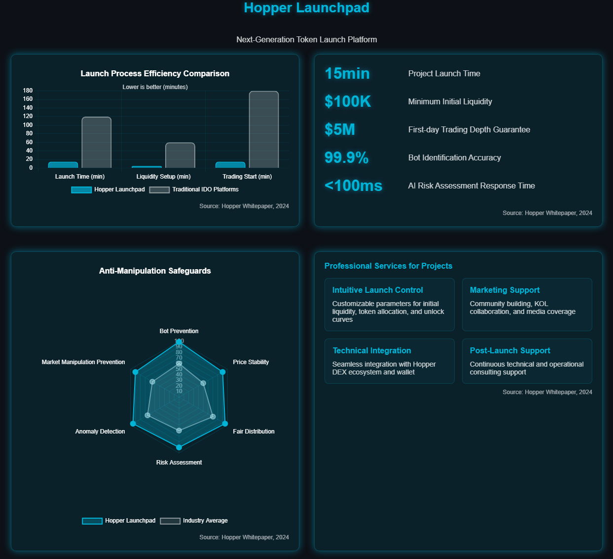

# Product Services

## **Trading System Architecture**

<figure><figcaption></figcaption></figure>

Hopper's trading system employs a breakthrough **hybrid architecture design** that innovatively combines **Automated Market Maker (AMM)** and **Centralized Limit Order Book (CLOB)** mechanisms. Through dynamically adjusted liquidity curves and multi-tiered liquidity pool design, the system can simultaneously meet the needs of transactions of different scales:

* **Small transactions** (<$10,000): Confirmation time **<2 seconds**
* **Large transactions** (>$1,000,000): Slippage controlled within **<0.5%**
* **Capital utilization**: **35%** improvement over traditional DEXs

At the order execution level, Hopper has developed an intelligent routing system that automatically analyzes and selects the optimal trading path. The system integrates an **8-layer deep price discovery mechanism** that calculates the depth and price of different liquidity pools in real-time, implementing multi-path split execution strategies that bring significant advantages to traders:

* **Large order transaction cost savings**: Up to **40%**
* **Smart splitting with minimal price impact**: Only **0.1%**
* **Path optimization calculation time**: <**10 milliseconds**

To ensure the security and stability of transactions, Hopper has built a comprehensive risk control system. The system monitors various anomalies in real-time, including price fluctuations, liquidity changes, and suspicious trading patterns. At the same time, **MPC (Multi-Party Computation)** and **smart contract audits** ensure the security of platform assets. In case of anomalies, the system can respond quickly and initiate corresponding protection mechanisms.

In terms of performance optimization, Hopper adopts a combination of on-chain and off-chain approaches:

* **On-chain optimization**: Through carefully designed smart contracts and transaction instructions, Gas costs are reduced by **30%** compared to traditional DEXs
* **Off-chain processing**: High-performance off-chain services handle order matching and market data, ensuring millisecond-level response
* **Hybrid architecture**: Combining on-chain security with off-chain efficiency to provide users with the best trading experience

This innovative architectural design not only guarantees the high performance and reliability of the system but also leaves ample room for future expansion, supporting the ability to process **10,000+** transaction requests per second.

## **Multi-Chain Support**

<figure><figcaption></figcaption></figure>

Hopper's multi-chain support strategy is founded on two high-performance public chains, **BNB Chain** and **Solana**, and extends to other mainstream blockchain networks through innovative cross-chain infrastructure. Our cross-chain architecture adopts an advanced **two-layer design**:

* **Bottom layer**: A secure and reliable cross-chain message transmission network ensuring information integrity and transmission security
* **Upper layer**: Highly optimized asset bridging and trading routing system, achieving seamless user experience

**Core Performance Indicators**:

* On-chain transaction confirmation: **<1 second**
* Cross-chain transfer success rate: **99.99%**
* Daily cross-chain transaction volume cap: **$50,000,000**

Among the public chains supported in the initial phase, besides Solana, we have prioritized integration with **Ethereum**, **BNB Chain**, and **Base**, which carry the most active DeFi ecosystems and user communities. Through deep strategic partnerships with top cross-chain infrastructure providers such as **Wormhole**, **LayerZero**, and **Axelar**, Hopper ensures the security and efficiency of cross-chain asset transfers. Especially in the Solana ecosystem, our intelligent cross-chain solution achieves:

* **Millisecond-level confirmation speed**: User experience close to centralized exchanges
* **Extremely low transfer costs**: Over 75% reduction in fees compared to traditional cross-chain bridges
* **Smart routing guarantee**: Automatically selects the optimal path, avoiding congested nodes

To optimize user experience, we have developed a breakthrough **cross-chain liquidity aggregation solution**. Users no longer need to manually transfer assets between different chains but can complete one-stop cross-chain transactions directly on Hopper. For example, users can directly purchase tokens on **Solana** using USDT on **Ethereum**, and the system will automatically complete the cross-chain transfer and token exchange process in the background. This innovative experience brings significant advantages:

* Support for seamless cross-chain exchange of **15+** mainstream tokens
* **40%** savings on cross-chain transaction fees
* One-stop cross-chain transaction completion time **<15 seconds**
* User operation steps reduced by **over 60%**

In terms of security, Hopper implements industry-leading security assurance mechanisms:

1. **Multi-Party Computation (MPC) Technology**: Distributed key management eliminates the risk of single-point failure
2. **Real-time Multi-layer Monitoring System**: Every cross-chain transaction undergoes strict security checks
   * Amount limits and threshold controls
   * Address verification and whitelist mechanisms
   * Behavioral pattern anomaly detection
3. **Cross-chain Asset Reserve Pool**: Ensures users can quickly withdraw assets at any time without waiting for cross-chain confirmation
4. **Intelligent Anti-attack System**: Automatically identifies and blocks malicious attack behaviors

In the future, as the blockchain ecosystem expands, Hopper will gradually extend support to **Layer 2** solutions and emerging high-performance public chains based on market demands and user feedback, ultimately realizing a truly seamless interconnected multi-chain DeFi ecosystem, providing users with borderless, low-friction global asset liquidity.

## **Launchpad Functionality Details**

<figure><figcaption></figcaption></figure>

Hopper Launchpad, as a next-generation token launch platform, not only maintains efficiency and convenience but also emphasizes **project quality** and **user fairness** as core design principles. Our launch mechanism addresses the pain points of traditional IDO platforms and innovatively solves several industry challenges:

* **Bot front-running**: Leading to unequal participation opportunities for ordinary users
* **Price volatility**: Damaging ecosystem stability and investor confidence
* **Complex listing processes**: Extending the time cycle from launch to trading

### **Liquidity-First Strategy**

We adopt a unique **"Liquidity-First"** strategy. Unlike the complicated listing requirements of traditional platforms, projects on Hopper only need to meet basic liquidity conditions to launch quickly. This efficient design brings significant advantages:

* **Project launch time**: Only **15 minutes**, shortening by up to 90% compared to traditional platforms
* **Initial liquidity requirement**: Minimum **$100,000**, paired with an intelligent token pair creation algorithm
* **First-day trading depth guarantee**: **$5,000,000**, ensuring sufficient trading activity

This efficient mechanism is particularly suitable for **MEME token projects** and other emerging projects that need to capitalize on short-term market trends, helping them enter the market at the optimal time.

### **Innovative Anti-Manipulation Safeguards**

Hopper has designed a comprehensive investor protection system, including:

* **Smart anti-dumping mechanisms**: Through smart contract-level trading restrictions and unlock curve controls
* **High-precision anti-bot system**:
  * Bot identification accuracy: **99.9%**
  * AI risk assessment response time: **<100ms**
  * Abnormal behavior alert accuracy: **95%**
* **Real-time AI market monitoring**: Identifying market manipulation and batch transaction anomalies

### **Professional Services for Projects**

Hopper provides projects with a comprehensive support ecosystem:

* **Intuitive launch control panel**: Projects can customize key parameters
  * Initial liquidity configuration
  * Token allocation ratio adjustment
  * Smart unlock curve design
* **Professional marketing support**: Helping quality projects maximize exposure
  * Community building and expansion
  * KOL collaboration network access
  * In-depth media coverage and content creation
* **Post-launch deep support**: Integration with Hopper DEX ecosystem resources
  * Immediate access to sufficient trading depth
  * Seamless integration with Hopper Wallet and other ecosystem products
  * Continuous technical and operational consulting support

## **Technical Innovation Points**

<figure><figcaption></figcaption></figure>

Hopper's technological innovations in the DeFi domain are primarily manifested in the following three core aspects:

### **1. Innovative Hybrid Market-Making Mechanism**

We seamlessly combine the simplicity of traditional **AMM** with the capital efficiency of **CLMM**, developing a unique **dynamic liquidity curve algorithm**. This algorithm, through real-time analysis of trading activities and market depth, adaptively adjusts liquidity distribution, achieving breakthrough performance improvements:

* **Capital efficiency improvement**: **35%**
* **Slippage loss reduction**: **50%**
* **Price stability improvement**: **40%**

This design allows liquidity providers to control capital allocation more precisely, while bringing traders more favorable price experiences and lower transaction costs.

### **2. AI-Enhanced Smart Routing System**

Hopper's intelligent transaction routing system holds a leading position in the industry. Through real-time multi-dimensional analysis of parallel liquidity pools' depth and prices, the system can achieve ultra-fast large order intelligent splitting and optimal path selection. In cross-chain transaction scenarios, our routing algorithm also comprehensively considers cross-chain fees, liquidity depth, and price impact factors to customize the optimal execution strategy for users.

The integrated **artificial intelligence prediction engine** brings predictive capabilities to the system, allowing it to identify potential arbitrage opportunities and market risks in advance:

* **Arbitrage space compression**: To within **0.1%**
* **Price prediction accuracy**: **85%+**
* **Optimal path calculation time**: **<10 milliseconds**

### **3. Preventive Token Launch Security Mechanism**

Hopper has developed a unique **"Liquidity Smart Lock"** system, an adaptive token locking mechanism that effectively prevents malicious selling by project teams and large holders through dynamic adjustment of lock periods and optimization of unlock curves.

The accompanying efficient **anti-bot system** employs cutting-edge behavioral pattern recognition algorithms that can accurately identify and block bot trading behaviors at the millisecond level:

* **Behavioral analysis precision**: With 5,000+ feature parameters
* **Recognition response speed**: **<5 milliseconds**
* **Prevention rate**: **Over 99.7%**

These technological innovations not only significantly enhance Hopper platform's performance metrics and user trading experience but also provide new solutions for the healthy development of the entire DeFi ecosystem. We are continuously investing resources in R\&D innovation, exploring more technological breakthroughs to promote a new paradigm of decentralized finance.

## **Security Design**

<figure><figcaption></figcaption></figure>

Hopper prioritizes security as the primary consideration in platform design, employing a multi-layered protective architecture to ensure the safety of user assets and transactions. Our security framework consists of four key pillars:

### **1. Smart Contract Security**

We employ the industry's most rigorous smart contract security measures:

* **Formal verification methods**: Using mathematical proofs to ensure code logic is flawless
* **Multiple audit certifications**: All core contracts undergo rigorous review by **4 top-tier security companies**
* **Code coverage**: Test coverage reaches **100%**, far exceeding industry average
* **Tiered permission management**: Implementing fine-grained access controls and time-lock mechanisms
* **Automated monitoring**: 24/7 intelligent monitoring system for real-time anomaly detection

### **2. Cryptographic Asset Custody Security**

Hopper innovatively employs distributed key management technology to protect user assets:

* **MPC multi-party computation technology**: Private keys stored across multiple independent secure nodes
* **Key sharding storage**: Any single point exposure will not lead to private key compromise
* **Hot-cold wallet isolation**: Large assets stored in completely offline cold storage systems
* **Multi-signature verification**: Using a **7/10 MPC signature mechanism** to ensure asset operation security

Especially when handling cross-chain assets, our security architecture ensures the integrity and security of asset transfers through multi-layer verification.

### **3. Real-time Risk Control and Anomaly Detection**

A comprehensive risk control system covers the entire transaction lifecycle:

* **Real-time price monitoring**: Preventing abnormal price fluctuations and manipulation
* **Liquidity health detection**: Ensuring pool depth and liquidity balance
* **Transaction pattern analysis**: Identifying suspicious transaction patterns and attack behaviors
* **Anomaly transaction identification speed**: **<1 second**, industry-leading level
* **AI risk control engine**: Able to predict and prevent common DeFi attack vectors:
  * Flash loan attacks
  * Oracle price manipulation
  * Re-entrancy attacks
  * Liquidity draining

### **4. Emergency Response and Asset Protection**

Multi-level defense mechanisms ensure user asset security even in extreme situations:

* **Emergency response mechanism**: Including response procedures for over 20 preset emergency scenarios
* **Transaction protection measures**: Emergency protection mechanisms can be triggered within **<5 seconds**
* **Insurance fund**: Maintaining insurance reserves of no less than **5%** of the platform's total locked assets
* **Third-party insurance protocols**: Partnerships with industry-leading DeFi insurance services
* **Bug bounty program**: Reward pool of up to **$500,000**, encouraging white hat hackers to participate in security construction

Hopper's multi-layered security design ensures the robust operation of the platform, allowing users to conduct transactions and manage assets in a truly secure and reliable environment. We adhere to the principle of "security first," continuously optimizing our security systems to address the evolving security challenges in the blockchain space.
