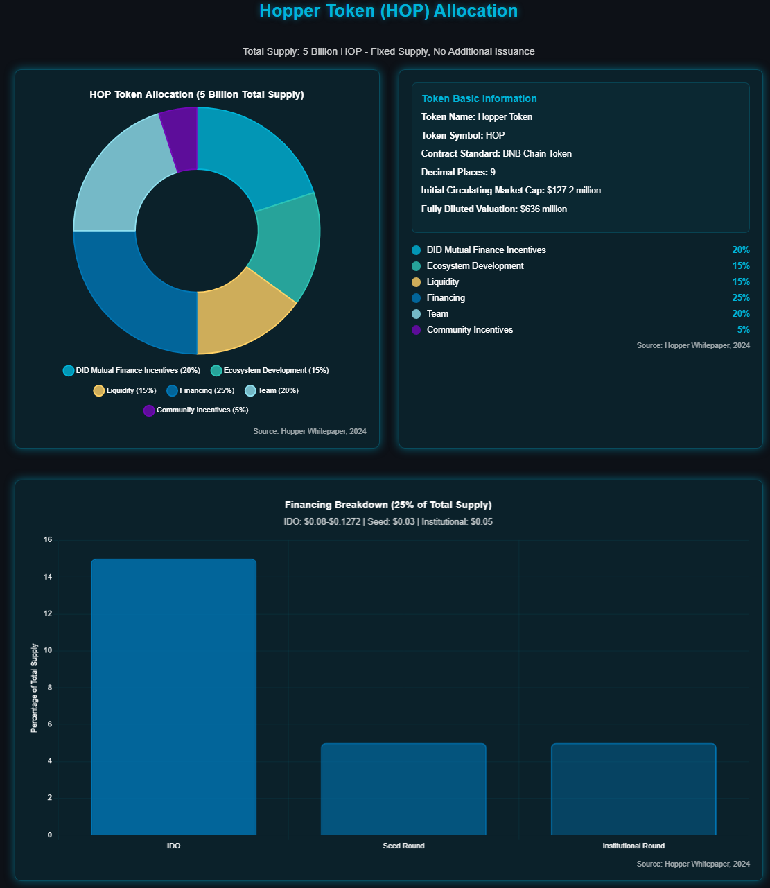

# 代币经济模型

## **代币基本信息**

* 代币名称：Hopper Token
* 代币符号：HOP
* 合约标准：BNB Chain Token
* 总供应量：50亿枚（固定供应，永不增发）
* 小数位数：9位
* 初始流通市值：1.272亿美元
* 完全稀释估值：6.360亿美元

<figure><figcaption></figcaption></figure>

## **代币分配方案（50亿HOP）**

|     类别     |  比例 |        释放时间        | 说明                                                                                                |
| :--------: | :-: | :----------------: | ------------------------------------------------------------------------------------------------- |
| DID 互助金融激励 | 20% |      36个月线性释放      | 每月释放一次，确保DID互助金融激励的长期性和可持续性。                                                                      |
|    生态建设    | 15% |       按里程碑释放       | 开发者完成生态里程碑后解锁，NFT魔方、三体及游戏生态的进展决定释放节奏。                                                             |
|     流动性    | 15% |       按周期动态释放      | 每季度释放一次，根据市场流动性需求动态调整释放量。                                                                         |
|     融资     | 25% |        分阶段释放       | - IDO 15%：TGE（代币生成事件）时释放100%。 - 种子轮5%：TGE时释放25%，剩余75%分36个月线性释放。 - 机构轮5%：TGE时释放20%，剩余80%分36个月线性释放。 |
|     团队     | 20% | TGE后锁定1年后分48个月线性释放 | TGE后锁定1年，之后按月线性释放。                                                                                |
|    社区激励    |  5% |       分两阶段释放       | TGE时释放100%，根据社区用户活跃度和贡献度，激励社区早期用户，如IDO与DID激励参与者、社区突出贡献者等。                                         |

## **代币效用详解**

平台费用折扣机制

*   基础折扣：

    * 1万HOP：10%交易费减免
      * 5万HOP：20%交易费减免
      * 10万HOP：30%交易费减免
      * 50万HOP：50%交易费减免
    * 额外优惠：
      * 长期持有者：每持有3个月增加5%折扣
      * 大额交易者：单笔100万美元以上额外8%
      * VIP用户：定制化手续费方案

    治理权益体系

    * 提案权限：
      * 需质押10万HOP
      * 提案类型：产品功能、参数调整、资金使用
      * 投票周期：7天
      * 通过条件：67%赞成票且投票率超30%
    * 投票权重：
      * 基础权重：1HOP = 1票
      * 锁仓倍数：最高3倍权重（365天锁仓）
      * 历史贡献：最高2倍权重加成

    优先权益详情

    * Launchpad特权：
      * 优先参与新项目IDO
      * 额外认购份额（最高5倍）
      * 专属空投资格
      * 早鸟认购折扣
    * 产品特权：
      * 新功能抢先体验
      * 专属交易对
      * API额度提升
      * 定制化报表

    质押收益机制

    * 单币质押：
      * 基础年化：8%
      * 锁仓倍数：30天1.2倍，90天1.5倍，365天2倍
      * 金额倍数：10万以上1.2倍，50万以上1.5倍
      * 最高可达：15%年化收益
    * LP质押：
      * 基础年化：10%
      * 深度奖励：与提供流动性深度挂钩
      * 稳定性奖励：持续提供流动性额外奖励
      * 最高可达：20%年化收益
    * 治理质押：
      * 基础年化：5%
      * 参与奖励：投票可获额外收益
      * 提案奖励：成功提案额外奖励
      * 最高可达：10%年化收益

## **代币回购销毁机制**

1. 回购来源：
   * 平台收入的30%用于回购
   * 超额利润分成（利润超预期部分的40%）
   * 特殊活动收入的50%
2. 回购执行：
   * 频率：每季度定期执行
   * 价格区间：0.1272U - 0.5U （根据实际情况DAO投票治理）
   * 单次规模：不超过当日成交量的20%
   * 公示制度：提前24小时公布回购计划
3. 销毁机制：
   * 目标：3年内回购销毁10%总量
   * 执行方式：链上公开销毁
   * 进度追踪：每月公布销毁进度
   * 通缩效应：减少流通供应，提升稀缺性

## **发行参数与估值模型**

1. 发行价格体系：
   * 种子轮：0.03U（估值1.5亿美元）
   * 机构轮：0.05U（估值2.5亿美元）
   * IDO价格：0.08U - 0.1272U（估值4亿美元 - 6.36亿美元）
2. 流通性安排：
   * 初始流通量：20%（10亿枚HOP）
   * 初始流通市值：1.272亿美元
   * 首月解锁量：不超过总量2%
   * 月均解锁量：约3-4%总量
3. 价值支撑：
   * 平台收入利润
   * 生态应用价值
   * 治理权益价值
   * 稀缺性价值
