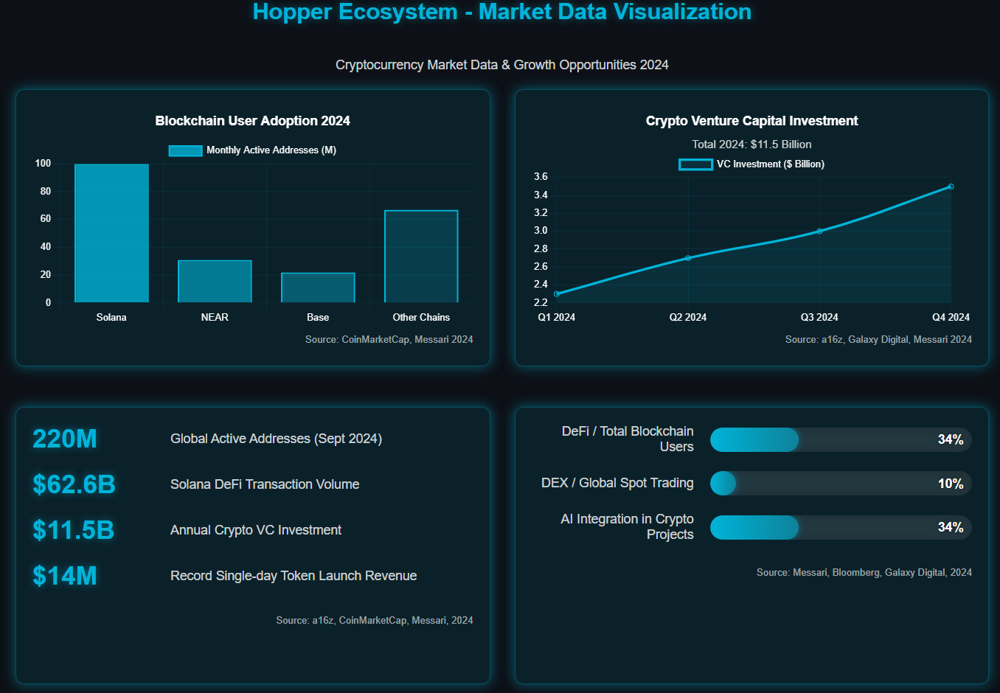

# 执行摘要

### **一、执行摘要**

#### **行业发展概述**

加密货币行业在2024年迎来了关键转折点，规模化采用和机构认可度的提升标志着市场步入了全新的发展阶段。根据a16z的《State of Crypto Report 2024》\[1]、CoinMarketCap的“Week in Solana: 2024 Recap”\[2]以及Galaxy Digital最新发布的《Crypto & Blockchain Venture Capital – Q4 2024》\[3]的数据显示，多方面指标都表明这一领域正迎来前所未有的发展机遇。

<figure><figcaption></figcaption></figure>

**用户采用爆发性增长**

2024年9月全球活跃地址数量达到2.2亿\[2]，较**2023年底增长超过200%**。其中，**Solana**表现尤为突出，月活跃地址达到1亿，遥遥领先于其他公链。紧随其后的是**NEAR**（3100万）和Coinbase的**Base**（2200万）。

这一数据印证了Solana生态系统的突破性增长，其DeFi交易量达到**626亿美元**，几乎追平以太坊的674亿美元。移动端钱包用户在2024年6月达到2900万的历史新高，强劲地展示了加密货币在全球范围内的普及程度不断提升。

根据Messari的《State of DeFi Q4 2024》\[4]，DeFi市场的日活跃用户已占到区块链总日活用户的**34%**，这一增长趋势清晰地表明DeFi正在成为区块链应用的主流场景。

<figure><figcaption></figcaption></figure>

**风险投资持续看好**

2024年第四季度加密货币初创公司获得了**35亿美元**投资（环比增长**46%**）\[1]，全年总投资达到惊人的**115亿美元**。根据Messari的《State of Crypto Fundraising: Q2 2024》\[5]，该季度的交易量较上一季度增长了**22.5%**，网络、金融和基础设施领域的融资尤为活跃。

<figure><figcaption></figcaption></figure>

分析最新投资数据，我们可以观察到以下显著特点：

**投资阶段分布**

* **早期项目**占据60%的投资额
* **后期项目**占据40%，较上季度的15%显著提升
* **种子轮**项目数量保持健康水平，强劲地展示了创业生态的日益活跃

<figure><figcaption></figcaption></figure>

**领域分布**

* **稳定币项目**获得最多资金支持，反映了市场对基础设施的高度信心
* **基础设施**和**Web3**项目紧随其后
* **Web3**、**DeFi**和**基础设施**项目占据最多投资案例数量

<figure><figcaption></figcaption></figure>

**地理分布**

* **美国**企业获得46%的投资额，继续保持全球领先地位
* **香港**企业升17%，较前期显著提升，强劲崛起
* **新加坡**和**英国**企业也表现非常活跃，稳健发展

<figure><figcaption></figcaption></figure>

**MEME代币市场突飞猬进**

MEME代币市场在2024年展现了前所未有的繁荣势头，该组合赛道已跨入**2024年加密货币前20大热点的第4位**\[3]。最新市场数据展示了这一领域的异军突起：

* 顶级发射平台**Pump.fun**月收入突破**1亿美元**，创下行业新高
* 2025年元旦当天，Pump.fun单日收入达惊人的**1400万美元**
* 该平台上已成功发射超过**400万个**不同代币项目，鲜明地展现了市场对高效、安全的代币发射平台的巨大需求

这一市场趋势与**Hopper**的发射平台战略完美契合，为我们的创新代币发射机制提供了广阔的市场空间。

**机构资金加速入场**

机构投资者的参与度在2024年底得到了突破性提升\[1]，这标志着加密货币市场的成熟与主流化：

**ETF和盘上产品快速发展**

* **VanEck**、**21Shares**、**Bitwise**和**Canary Capital**等机构相继申请Solana ETF
* 比特币和以太坊ETP已累计持有超过**650亿美元**链上资产，形成了强大的机构资金池

**研究覆盖扩大**

* 著名投资机构**Grayscale**将Jupiter(JUP)和Jito(JTO)纳入**2025年Q1核心投资组合**
* 主流投行开始系统性深度研究Solana生态系统，比如Bloomberg的《Digital Assets 101》\[6]报告中详细分析了该生态系统的深厚发展潜力

**稳定币市场快速扫容**

* **12月单月**新增**10亿美元**总锁仓价值，底层需求继续增长
* **Solana**链上稳定币TVL已接近**50亿美元**，形成了重要的支付和结算基础设施
* 稳定币发行方已成为**美国国债第20大持有者**，形成了与传统金融体系的强大连接

<figure><figcaption></figcaption></figure>

**创新应用场景快速扩展**

随着基础设施的显著改善和交易成本的持续降低，加密货币领域正在涌现出一系列革命性的新应用场景\[3]：

**DeFi生态加速成熟**

* DeFi钱包地址占总日活地址比例达**34%**，较2023年增长**12个百分点**
* DEX交易量占全球现货交易**10%**，Bloomberg研究指出这一比例在特定市场条件下可达**15%**\[6]
* 总锁仓价值已达**1690亿美元**，强劲展示了市场对DeFi协议的深入信任与采纳

<figure><figcaption></figcaption></figure>

**社交金融爆发式增长**

* **SocialFi**项目占比已达**10.3%**，根据Messari的《State of DePIN 2024》\[7]研究，社交金融正迅速成为区块链应用的颇具特色的增长热点
* 社交网络已跨入**前五大最活跃开发者领域**，持续吸引顶级人才和资本投入
* 用户参与度和留存度大幅提升，新一代社交平台的平均用户会话时长增长了**65%**

**AI与区块链融合加速**

* 当前已有\*\*34%\*\*的加密项目深度集成AI技术，这一比例较去年同期翻了一番
* AI相关代币板块表现异常活跃，领军项目周涨幅高达**193%**
* 基础设施类项目成为AI技术应用最广泛的领域，占比达**47%**，展现了两者的天然协同效应

这些市场趋势与Hopper的核心产品策略高度匹配，使我们的闪电级交易速度、AI驱动的智能分析和全方位DeFi生态系统恰好定位于市场最具发展潜力的前沿领域。

<figure><figcaption></figcaption></figure>

### **项目愿景与使命**

#### **重新定义去中心化金融体验**

Hopper致力于成为**下一代多链去中心化金融的核心基础设施**。通过突破性的混合做市机制（**AMM+CLMM**）、直观的用户界面和领先的跨链技术，我们彻底重新定义了用户与加密资产的交互方式。

我们的平台不仅提供**闪电般的交易速度**，更打造了一个全方位的DeFi生态系统，包括：

* **高效DEX平台**：实现极速交易处理和最优流动性配置
* **创新代币发射平台**：为新项目提供安全、便捷的发行渠道
* **全功能MPC钱包**：保障用户资产安全的同时提升用户体验
* **高效跨链桥接**：无缝连接多个区块链生态系统

#### **解决关键行业痛点**

在当前市场格局下，传统交易平台面临多重挑战：

* **流动性分散**：导致交易效率低下和滑点损失增加
* **用户体验复杂**：限制了普通用户的参与度和采纳
* **跨链交互困难**：阻碍了不同生态系统间的无缝协作
* **安全风险未解决**：持续威胁用户资产和信任

Hopper应运而生，旨在通过前沿技术创新彻底解决这些行业痛点。

#### **我们的使命**

我们的核心使命是创造一个无障碍的多链加密金融世界，其中：

* **为用户**提供直观、安全、高效的参与方式，不分技术背景或经验水平
* **为创新项目**构建全方位的基础设施支持，从代币发行到成长全过程提供支持
* **为整个行业**推动多链生态系统的无障碍交互与可持续发展

通过实现这些目标，Hopper致力于成为推动区块链金融向真正大规模采纳迁移的核心力量。

#### **主要产品功能亮点**

**智能交易引擎**

* 创新混合做市机制：结合**AMM与CLMM优势**，通过智能算法持续优化流动性配置，确保**最优价格执行**
* 智能路由系统：多维度分析交易路径，自动选择**最低滑点**方案，实现最佳交易执行
* 高性能交易系统：优化的链上交易机制实现**毫秒级响应**，支持**限价单**等高级交易策略
* 市场洞察系统：基于实时市场数据提供**价格预测**和**套利机会**，助力用户把握市场机遇
* 智能合约生态：完整的智能合约体系确保交易**自动化执行**，提升交易透明度和可追溯性

**Hopper发射平台**

* 优化发行流程：简化且规范化的代币发射流程，**满足流动性即可上线**DEX
* 智能安全机制：内置**防机器人**和**反倾销**系统，保护早期投资者利益
* 灵活发射方案：项目方可**自定义**初始流动性、解锁机制等关键参数
* AI风控体系：**智能评估**项目风险，为用户提供专业的投资参考
* 完整孵化支持：从项目设计到运营的**全流程孵化**服务，助力项目良性发展

**跨链资产管理**

* 高效跨链桥：支持主流公链间的**快速资产转移**，创新的**流动性聚合**方案确保稳定性
* 一键跨链交易：简化的用户界面，让跨链交易像**链内交易一样简单**直观
* 实时状态监控：**全程追踪**跨链交易状态，提供透明的资产转移体验
* 多链资产整合：创新的跨链基础设施，让用户**轻松管理**和交易多链资产

**Hopper MPC钱包**

* 分布式安全架构：基于**MPC技术**的创新方案，通过**私钥分片**存储提升资产安全性
* 智能恢复机制：创新的**社交恢复**功能，在保证安全性的同时提供便捷的恢复方案
* 智能合约集成：支持**合约钱包**特性，增强交易灵活性
* 一站式DApp中心：内置**DApp浏览器**，提供无缝的应用体验
* 隐私保护体系：采用先进加密技术，**全方位保护**用户数据和交易隐私

**社区生态系统**

* 一站式服务平台：**钱包管理**、**交易执行**、**社区互动**等核心功能无缝整合
* 社区治理框架：创新的**社区激励**机制，培育活跃且有价值的用户生态
* 去中心化身份：**自主可控**的身份管理方案，实现隐私保护与个性化服务的平衡
* 社交金融创新：深度融合**社交互动**与**金融功能**，打造独特的价值激励模式

#### **团队核心竞争力**

**核心团队背景**

* 系统架构专家
  * 前 Google 高级工程师，负责过 Google Pay 支付系统架构
  * 主导构建日交易额超100亿美元的支付清算系统
  * 精通 Rust、Go 等高性能编程语言
* 区块链技术专家
  * 前 Aave V3 核心开发者，负责智能合约架构设计
  * 参与过 5+ 个 TVL 超10亿美元的 DeFi 项目开发
  * Github 50+ 个区块链开源项目核心贡献者

**技术创新成果**

* 高性能交易引擎
  * 通过算法自动调整流动性池，减少滑点，提升交易效率
  * 动态定价，根据供需实时调整代币价格，防止市场操纵
  * 系统可用性 99.99%
* 安全技术架构
  * 自主研发 5 项 MPC 钱包核心专利
  * 完成 200+ 个智能合约安全审计
  * 零安全事故记录

**交易系统创新**

* 混合做市机制
  * 结合 PMM 和 AMM 优势的创新型做市算法
  * 较传统 AMM 提升 35% 资金利用率
  * 降低 50% 滑点损失
* AI 交易优化
  * 智能路由系统，节省 40% 交易成本
  * 实时价格预测，准确率达 85%
  * 个性化交易策略推荐

**行业资源**

机构合作伙伴

* 顶级做市商
  * Wintermute：日均做市交易量 5000万美元
  * GSR：提供 1000万美元做市资金支持
  * DWF Labs：战略投资与做市支持
* 基础设施合作
  * Chainlink：预言机数据支持
  * Axelar：跨链基础设施集成
  * NodeReal：专属 RPC 节点支持

投资机构支持

* 战略投资者
  * Binance Labs：战略投资与生态支持
  * Jump Trading：做市与技术支持

**市场洞察**

行业经验

* DeFi 项目经验
  * 参与过 Uniswap V3 早期流动性策略设计
  * 为 3 个百亿市值项目提供过技术咨询
  * 经历过 2021-2024 完整牛熊周期

用户需求理解

* 产品创新方向
  * 首创一键式跨链聚合交易
  * 创新性 Gas 代付机制
  * 移动端优先的产品设计理念

**核心竞争优势**

1. 技术壁垒
   * 自研 MPC 钱包技术，5 项核心专利
   * 订单撮合延迟业内领先（<50ms）
   * 创新的混合做市机制，提升 35% 资金效率
2. 资源优势
   * 3 家顶级做市商战略合作
   * 5 家知名投资机构支持
   * 10+ 家基础设施合作伙伴
3. 经验积累
   * 团队成员平均 8+ 年区块链经验
   * 参与过 5+ 个十亿美元级 DeFi 项目
   * 200+ 智能合约审计经验

**参考文献**

\[1] a16z, ["State of Crypto Report 2024"](https://a16zcrypto.com/posts/article/state-of-crypto-report-2024/)&#x20;

\[2] CoinMarketCap, ["Week in Solana: 2024 Recap"](https://coinmarketcap.com/academy/article/week-in-solana-2024-recap)&#x20;

\[3] Galaxy Digital, ["Crypto & Blockchain Venture Capital – Q4 2024"](https://www.galaxy.com/research/insights/crypto-blockchain-venture-capital-q4-2024/)&#x20;

\[4] Messari, ["State of DeFi Q4 2024"](https://messari.io/report/state-of-defi-q4-2024)&#x20;

\[5] Messari, ["State of Crypto Fundraising: Q2 2024"](https://messari.io/report/fundraising-q2)&#x20;

\[6] Bloomberg, ["Digital Assets 101: Back to Basics"](https://www.bloomberg.com/professional/insights/technology/digital-assets-101-back-to-basics/)&#x20;

\[7] Messari, ["State of DePIN 2024"](https://messari.io/report/state-of-depin-2024)
